# Reporte de Reuniones 1a1 Iniciales - CalTeks

## Resumen Ejecutivo

Este reporte analiza las 12 reuniones 1a1 iniciales realizadas con el equipo de tecnología de CalTeks, proporcionando insights clave sobre preferencias de comunicación, objetivos profesionales, expectativas y áreas de mejora identificadas por el equipo.

## Participantes del Estudio

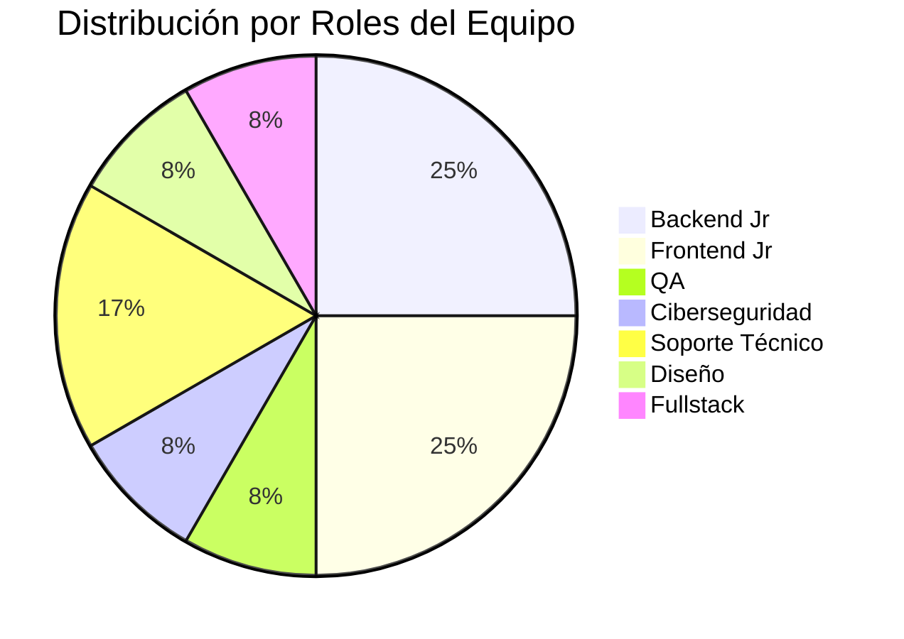

### Lista de Participantes
1. **Anel Martez** - Backend Jr
2. **Christian Blades** - Frontend Jr  
3. **Didiel Saenz** - QA
4. **Eva Gutierrez** - Backend Jr
5. **Flavio Sánchez** - Backend
6. **Gloriam Luna** - Frontend
7. **Gustavo Jordan** - Diseño/Fullstack
8. **Javier Quezada** - Ciberseguridad
9. **Johan Miguel Ovalle** - Backend Jr
10. **Jonathan Nunez** - Frontend
11. **Kelly Pindian** - Soporte Técnico
12. **Luis Henrique Jarquin** - Frontend/Soporte

## Análisis de Preferencias de Comunicación

### Medios Preferidos para Retroalimentación

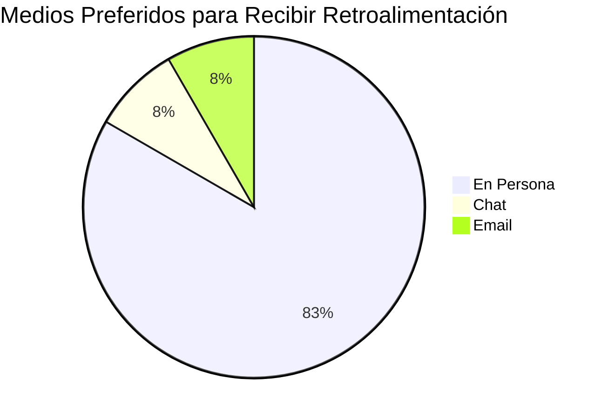

### Momento Preferido para Retroalimentación

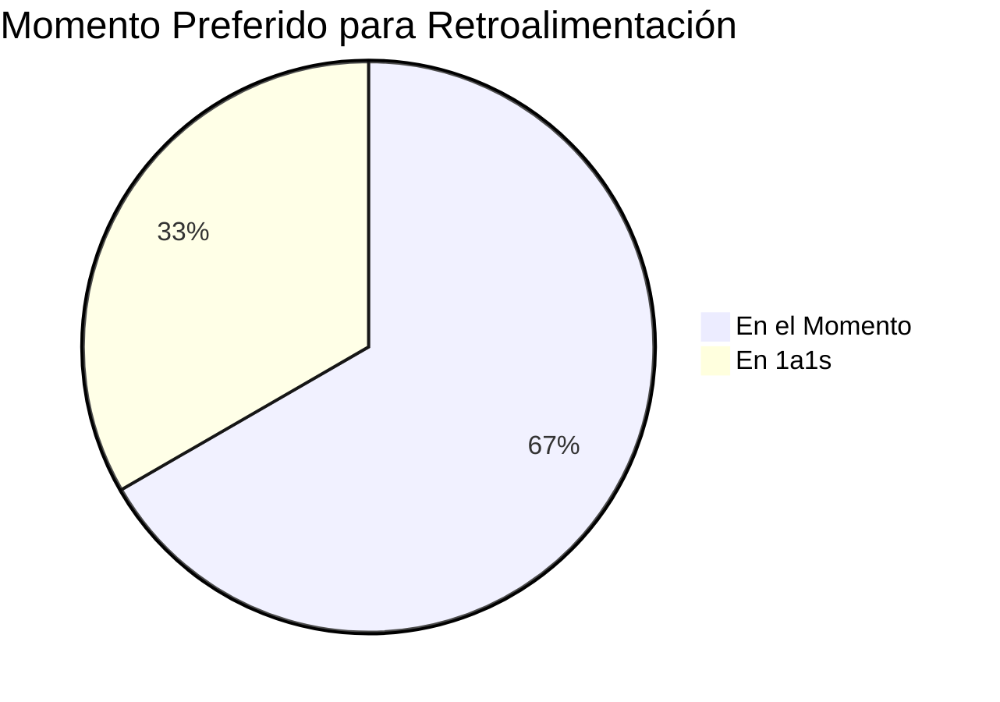

### Tipo de Reconocimiento Preferido

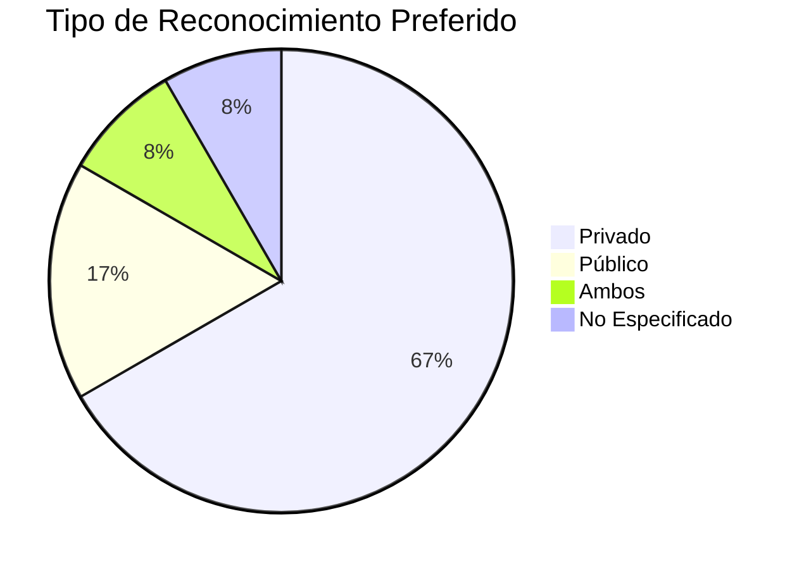

## Análisis de Productividad

### Condiciones Óptimas de Trabajo

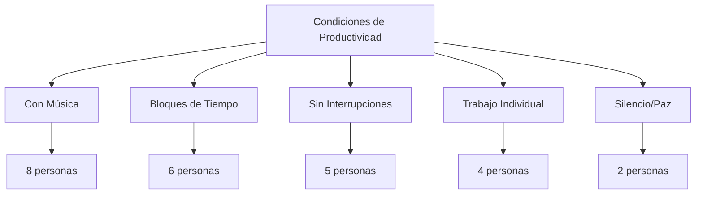

## Objetivos Profesionales a 12 Meses

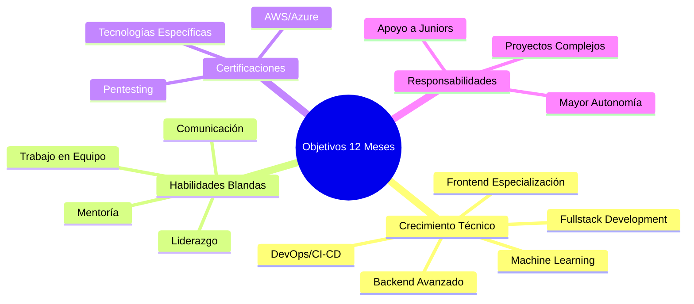

## Expectativas del Equipo

### Lo que Esperan del Manager

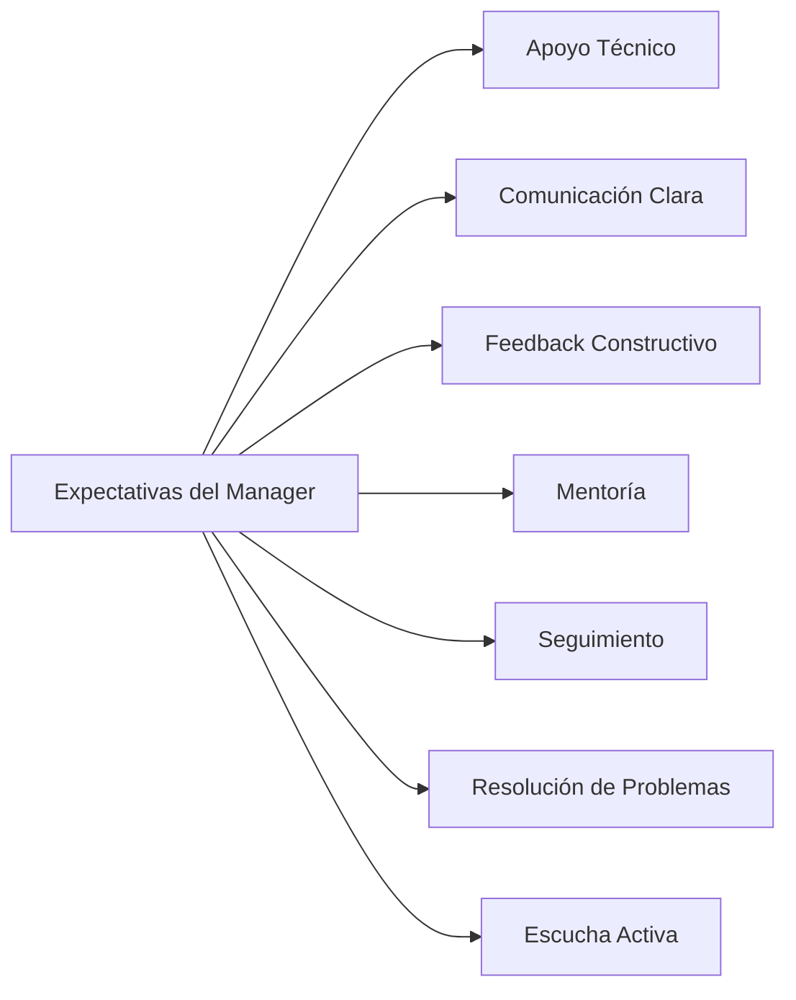

### Lo que Esperan del Equipo

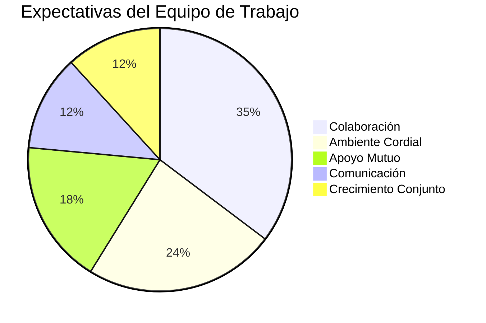

## Satisfacción con CalTeks

### Aspectos Más Valorados

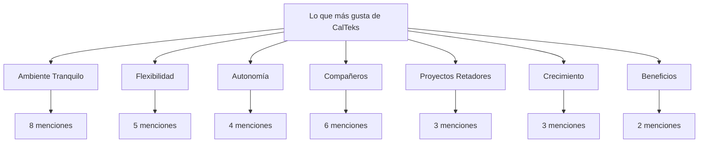

### Principal Cambio Deseado

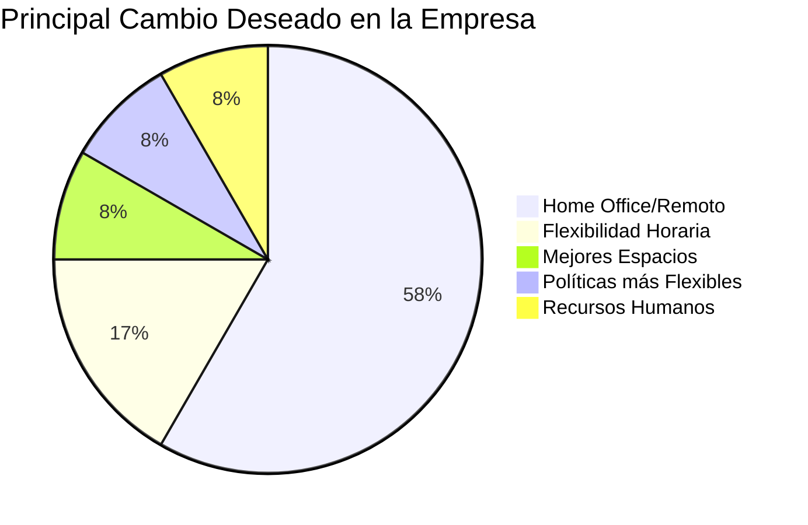

## Frecuencia Preferida para 1a1s

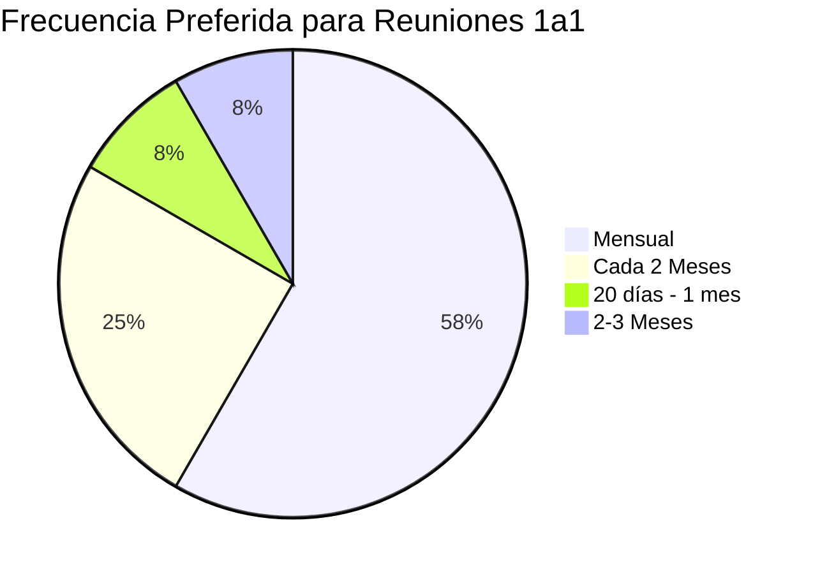

## Áreas de Mejora Identificadas

### Procesos que Requieren Atención

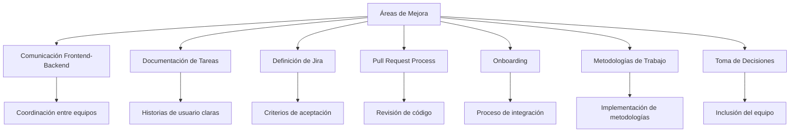

## Fortalezas Técnicas del Equipo

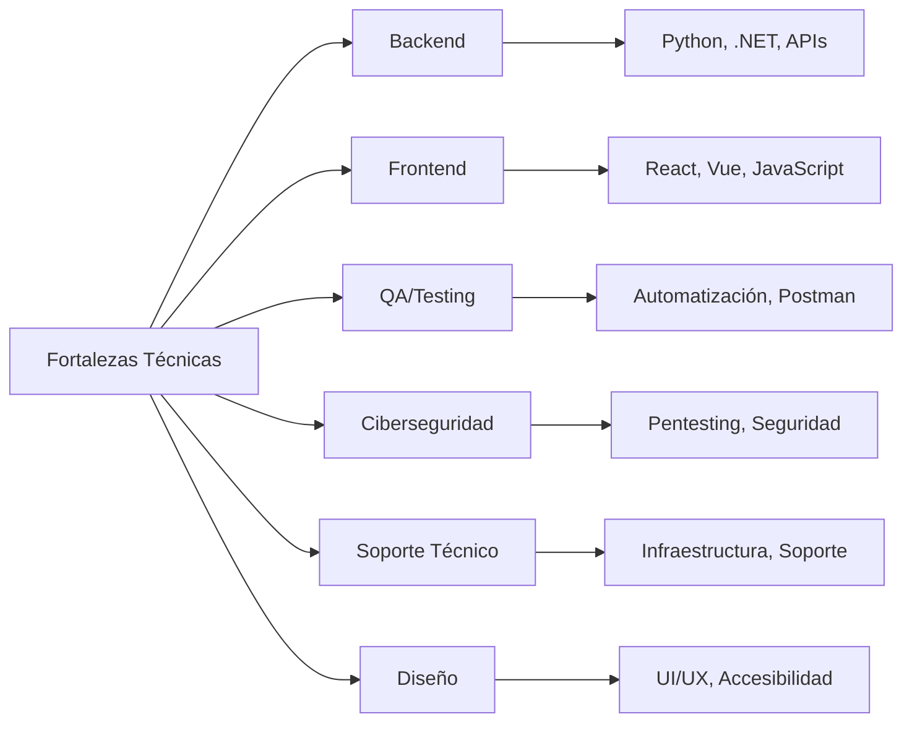

## Comidas y Postres Favoritos

### Top Comidas Favoritas
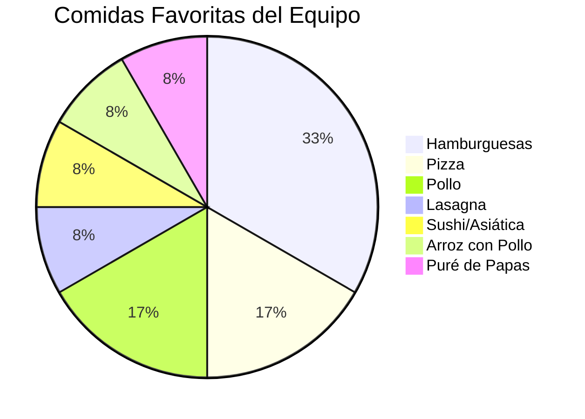

### Top Postres Favoritos
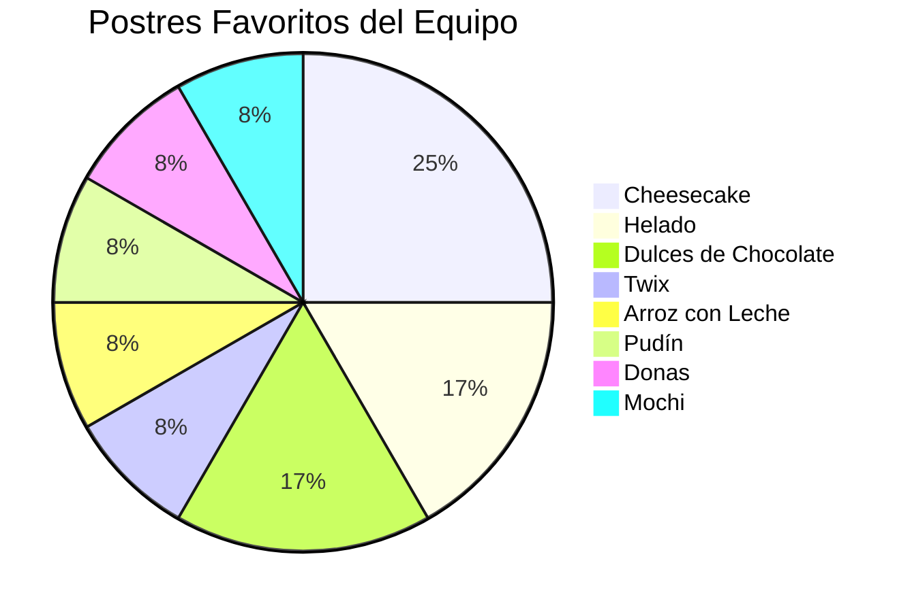

## Recomendaciones Estratégicas

### Acciones Inmediatas (1-3 meses)

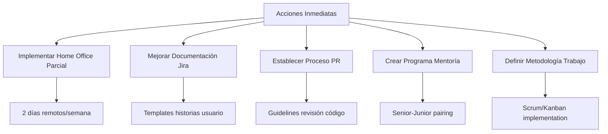

### Acciones a Mediano Plazo (3-6 meses)

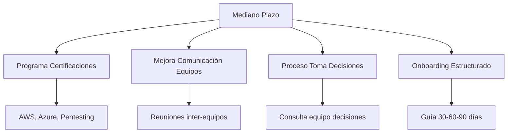

### Acciones a Largo Plazo (6-12 meses)

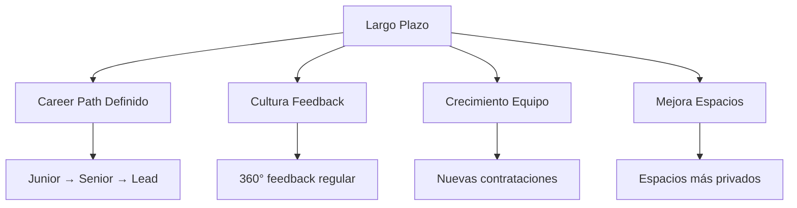

## Conclusiones

### Fortalezas del Equipo
- **Alta colaboración**: El equipo muestra disposición para ayudarse mutuamente
- **Ambiente positivo**: Valoración del ambiente tranquilo y flexible
- **Diversidad técnica**: Amplio rango de habilidades técnicas
- **Motivación por aprender**: Interés en certificaciones y nuevas tecnologías

### Áreas de Oportunidad
- **Comunicación inter-equipos**: Necesidad de mejorar coordinación Frontend-Backend
- **Procesos documentados**: Falta de metodologías claras y documentación
- **Flexibilidad laboral**: Demanda alta por opciones de trabajo remoto
- **Desarrollo profesional**: Necesidad de paths de carrera más claros

### Riesgos Identificados
- **Rotación potencial**: Algunos miembros evalúan opciones externas
- **Burnout**: Menciones de estrés y sobrecarga en algunos casos
- **Comunicación**: Conflictos interpersonales que requieren atención

## Próximos Pasos

1. **Implementar reuniones 1a1 mensuales** con cada miembro del equipo
2. **Desarrollar plan de home office** piloto
3. **Crear templates de Jira** mejorados
4. **Establecer programa de mentoría** Senior-Junior
5. **Definir proceso de revisión de código** estándar
6. **Planificar programa de certificaciones** 2024

---

*Reporte generado el: Septiembre 2025*  
*Reuniones realizadas: 12*  
*Participación: 100% del equipo de tecnología*