# Reporte Preliminar 1a1 - Equipo de Calteks

## Resumen Ejecutivo

Este reporte final consolida los hallazgos de las 12 reuniones 1a1 iniciales realizadas con el equipo completo de tecnología de CalTeks durante septiembre de 2025. El análisis abarca preferencias de comunicación, objetivos profesionales, expectativas del equipo, percepción de la empresa y recomendaciones estratégicas para el desarrollo organizacional.

### Alcance del Estudio
- **Total de participantes**: 12 miembros del equipo de tecnología
- **Duración promedio por reunión**: 45-60 minutos
- **Cobertura**: 100% del equipo técnico
- **Período de realización**: Septiembre 2025
- **Metodología**: Entrevistas individuales estructuradas

---

## Participantes del Estudio

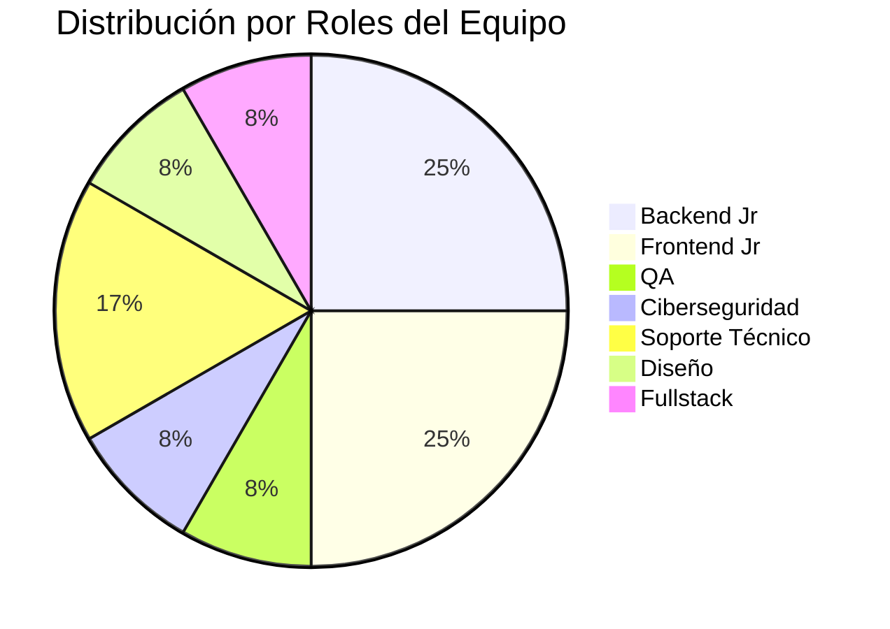

### Lista Completa de Participantes

| Nombre                | Rol                     | Experiencia                              |
| --------------------- | ----------------------- | ---------------------------------------- |
| Anel Martez           | Backend Jr              | Primer trabajo como programador completo |
| Christian Blades      | Frontend Jr             | Ing. Sistemas ULACIX                     |
| Didiel Saenz          | QA                      | Ing. Sistemas, cursos automatización     |
| Eva Gutierrez         | Backend Jr              | UP Ing. Informática (2 meses)            |
| Flavio Sánchez        | Backend                 | UTP Lic. Desarrollo Software + Maestría  |
| Gloriam Luna          | Frontend                | UTP Ing. Sistemas y Computación          |
| Gustavo Jordan        | Diseño/Frontend/Backend | UTP Desarrollador Software               |
| Javier Quezada        | Ciberseguridad          | Ing. Sistemas Latina (sin culminar)      |
| Johan Miguel Ovalle   | Backend Jr              | UTP Ing. Sistemas y Computación          |
| Jonathan Nunez        | Frontend                | UTP Ing. Desarrollo Software             |
| Kelly Pindian         | Soporte Técnico         | Universidad Del Istmo                    |
| Luis Henrique Jarquin | Frontend/Soporte        | UMECIT Lic. Sistemas                     |

---

## Análisis de Preferencias de Comunicación

### Medios Preferidos para Retroalimentación

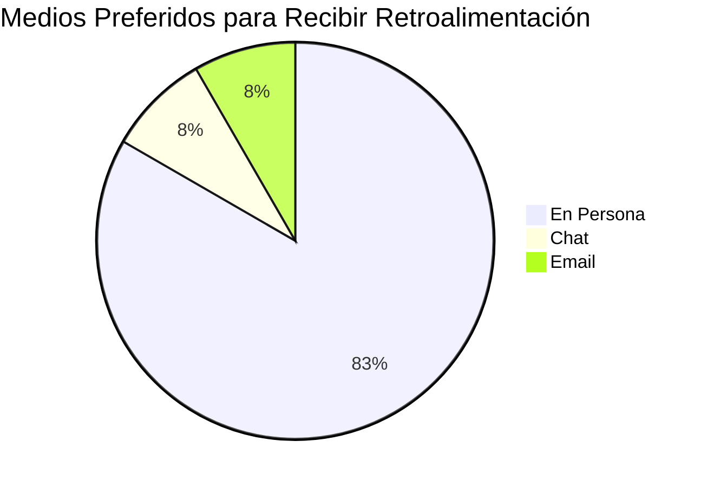

**Hallazgos clave:**
- **83% prefiere feedback en persona** - Mayoría absoluta valora la comunicación directa
- **Chat/Teams**: Como complemento para aclaraciones menores
- **Email**: Solo para documentación formal

### Momento Preferido para Retroalimentación

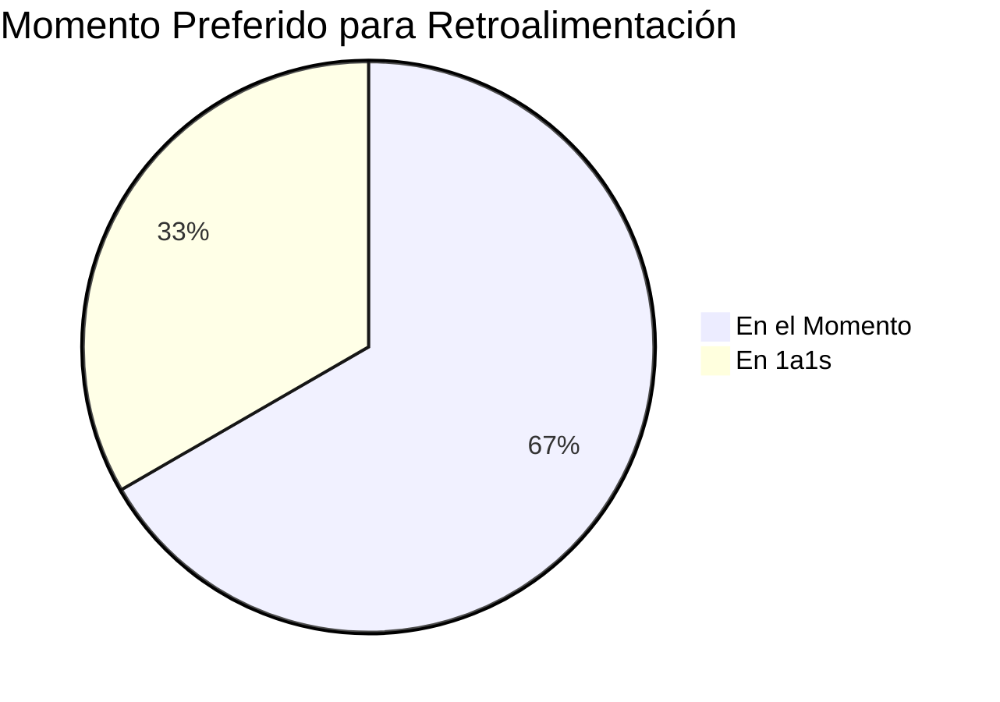

**Distribución detallada:**
- **En el momento**: 67% prefiere retroalimentación inmediata
- **En reuniones 1a1**: 25% prefiere feedback estructurado en sesiones programadas
- **Ambos**: 8% acepta cualquier modalidad

### Tipo de Reconocimiento Preferido

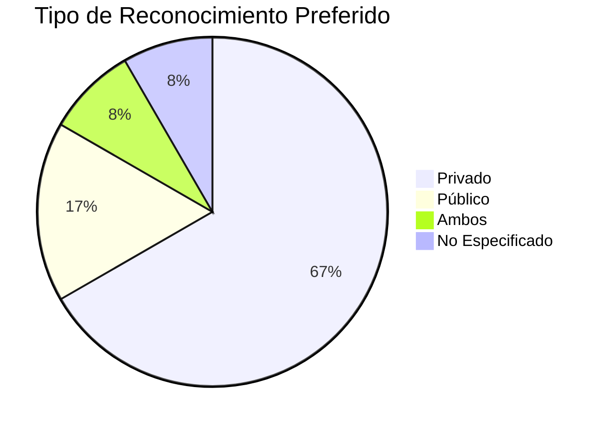

**Preferencias específicas:**
- **Privado**: 75% prefiere reconocimiento privado
- **Público**: 17% se siente cómodo con reconocimiento público (Eva Gutierrez, Gustavo Jordan)
- **Ambos**: 8% acepta cualquier tipo (Jonathan Nunez)

---

## Análisis de Productividad y Ambiente de Trabajo

### Condiciones Óptimas de Trabajo

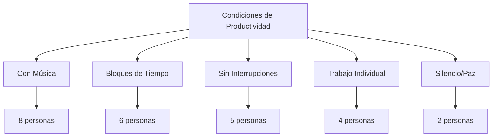

**Factores de productividad identificados:**
- **Música**: 67% trabaja mejor con música de fondo
- **Bloques de tiempo**: 50% necesita períodos largos sin interrupciones
- **Trabajo individual**: Mayoría prefiere trabajo independiente con colaboración puntual
- **Ambiente tranquilo**: Valoración del ambiente relajado actual

**Factores que afectan negativamente:**
- Interrupciones constantes
- Tareas mal definidas
- Presión temporal excesiva
- Falta de claridad en requerimientos

---

## Objetivos Profesionales y Desarrollo

### Objetivos Profesionales a 12 Meses

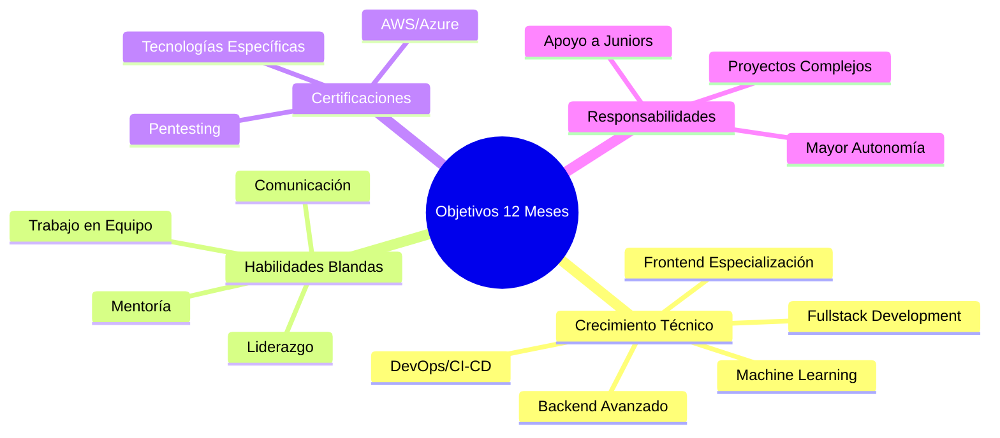

**Tendencias principales identificadas:**
- **Crecimiento técnico**: Dominio de tecnologías backend/frontend
- **Independencia**: Resolución autónoma de problemas técnicos
- **Especialización**: Certificaciones en áreas específicas (AWS, Azure, Pentesting)
- **Liderazgo técnico**: Aspiraciones de mentoría y guía de equipos
- **Fullstack**: Varios quieren expandirse entre frontend y backend

**Objetivos específicos destacados:**
- **Anel**: Frontend maintenance, manejo de backend
- **Christian**: Mejorar lógica de programación, estabilidad profesional
- **Eva**: Programar más fluidamente, mayor responsabilidad
- **Flavio**: DevOps CI/CD, Machine Learning, Data Science
- **Johan**: Trabajar como fullstack
- **Luis**: Independencia en solución de problemas, backend

## Expectativas del Equipo

### Lo que Esperan del Manager

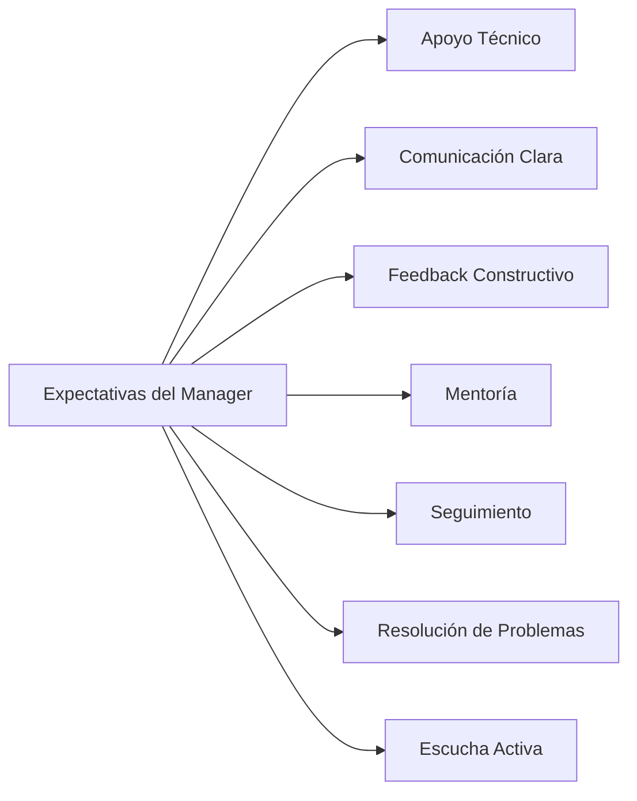

**Comportamientos más valorados:**
- Escucha activa y comunicación clara
- Apoyo técnico y mentoría estructurada
- Feedback constructivo y oportuno
- Solución de problemas y eliminación de bloqueos
- Trato justo y sin favoritismos
- Seguimiento de tareas y progreso
- Definición clara de requerimientos

### Lo que Esperan del Equipo

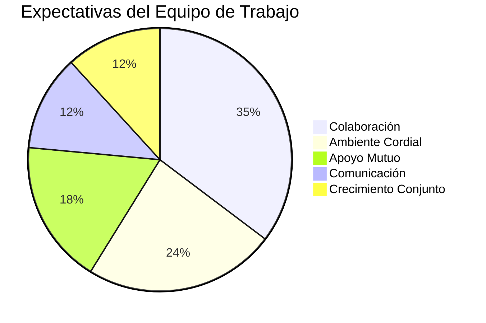

**Expectativas principales:**
- Unidad y apoyo mutuo entre compañeros
- Ambiente colaborativo sin conflictos
- Comunicación efectiva entre áreas
- Trabajo en equipo real y coordinado
- Crecimiento profesional conjunto

---

## Satisfacción con CalTeks

### Aspectos Más Valorados

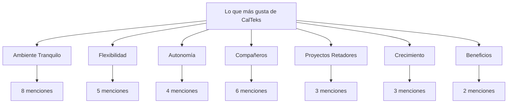

**Aspectos positivos más mencionados:**
- **Ambiente tranquilo y relajado**: Sin presión excesiva ni micromanagement
- **Autonomía en el trabajo**: Libertad para gestionar tareas
- **Flexibilidad**: No marcar tarjeta, horarios flexibles
- **Compañeros colaborativos**: Disposición de ayuda mutua
- **Oportunidades de aprendizaje**: Variedad de proyectos y tecnologías
- **Crecimiento organizacional**: Expansión del departamento

### Principal Cambio Deseado

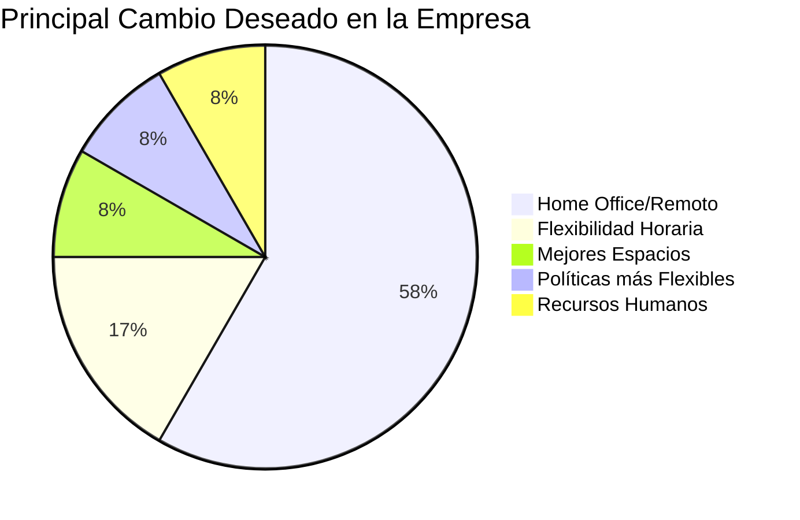

**Áreas de mejora más solicitadas:**
- **Home Office/Remoto**: 67% solicita mayor flexibilidad de trabajo remoto
- **Código de vestimenta**: Relajación de políticas formales
- **Aumentos salariales**: Reconocimiento económico del desempeño
- **Capacitación**: Mayor inversión en cursos y certificaciones
- **Mejor comunicación organizacional**: Procesos más claros
- **Mejores espacios**: Mayor privacidad en puestos de trabajo

## Frecuencia Preferida para Reuniones 1a1

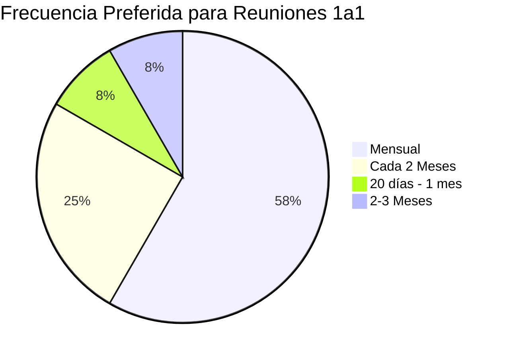

**Distribución de preferencias:**
- **Mensual**: 58% prefiere reuniones mensuales
- **Cada 2 meses**: 25% considera suficiente cada dos meses
- **Flexible (1-2 meses)**: 17% acepta variabilidad según necesidades

---

## Áreas de Mejora Identificadas

### Procesos que Requieren Atención

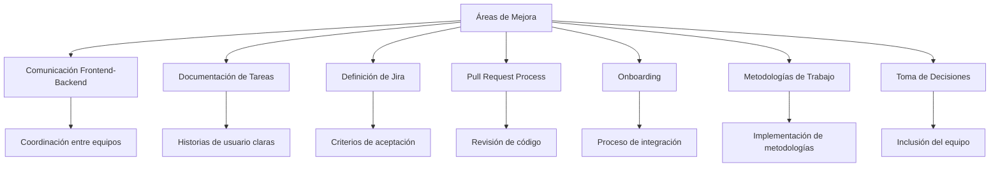

**Problemas críticos identificados:**

### 1. Comunicación y Procesos
- Falta de concordancia entre tareas frontend-backend
- Documentación insuficiente en proyectos
- Tareas de Jira poco claras o mal definidas
- Problemas en pull requests y revisión de código
- Falta de metodología de trabajo estructurada

### 2. Desarrollo Profesional
- Mentoría inconsistente y falta de programas estructurados
- Dependencia excesiva en herramientas de IA
- Limitado acceso a programas de certificación profesional
- Ausencia de planes de carrera claros

### 3. Gestión de Recursos Humanos
- Políticas rígidas de código de vestimenta y trabajo remoto
- Falta de programas formales de reconocimiento
- Riesgo de rotación por falta de crecimiento salarial
- Conflictos interpersonales que requieren mediación

---

## Fortalezas Técnicas del Equipo

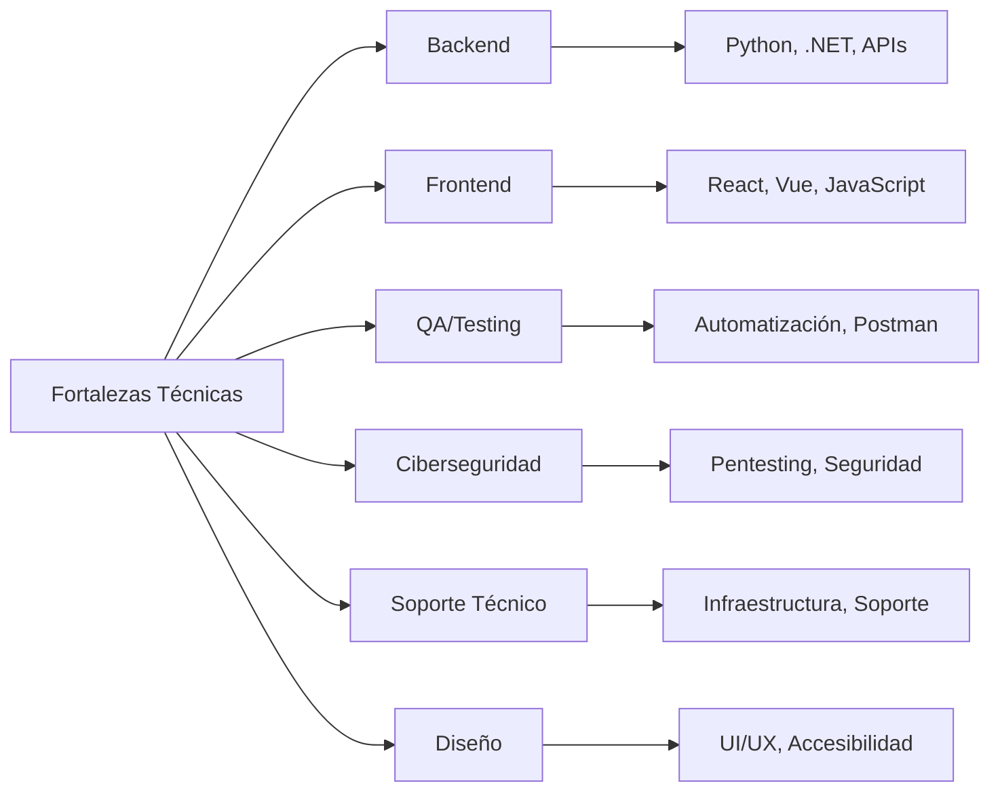

### Análisis por Área Técnica

#### Desarrollo Backend
**Equipo**: Anel Martez, Eva Gutierrez, Flavio Sánchez, Johan Miguel Ovalle
- **Fortalezas**: Diversidad de experiencia, interés en tecnologías emergentes (ML, DevOps, Cloud)
- **Desafíos**: Inconsistencia en niveles de experiencia, necesidad de estándares de código

#### Desarrollo Frontend  
**Equipo**: Christian Blades, Gloriam Luna, Jonathan Nunez, Luis Henrique Jarquin
- **Fortalezas**: Conocimiento sólido en frameworks modernos (React, Vue), interés en UX
- **Desafíos**: Conflictos con backend en definición de APIs, falta de estándares de accesibilidad

#### Quality Assurance
**Equipo**: Didiel Saenz
- **Fortalezas**: Experiencia en automatización (Karate, Postman, Jenkins)
- **Desafíos**: Trabajo individual, necesidad de integración temprana en desarrollo

#### Ciberseguridad y Soporte
**Equipo**: Javier Quezada, Kelly Pindian
- **Fortalezas**: Conocimiento especializado, actitud proactiva
- **Desafíos**: Falta de awareness de seguridad en el equipo, procesos no integrados.

## Datos Curiosos - Preferencias Personales

### Top Comidas Favoritas
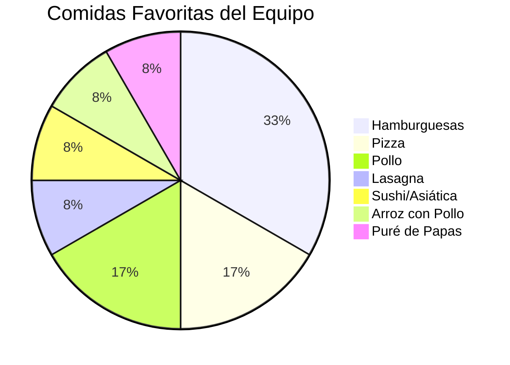

### Top Postres Favoritos
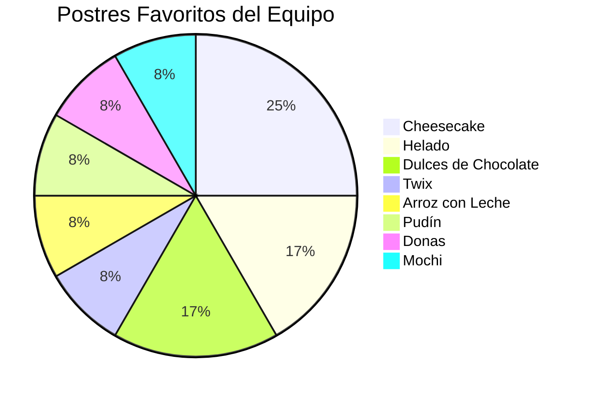

---

## Plan de Acción y Recomendaciones Estratégicas

### Acciones Inmediatas (1-3 meses)

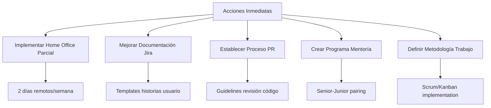

#### 1. Mejora de Procesos de Comunicación
- **Implementar reuniones 1a1 regulares**: Frecuencia mensual con cada miembro
- **Establecer canales de feedback**: Procesos formales para retroalimentación constructiva
- **Workshops de comunicación**: Sesiones para mejorar colaboración interdepartamental
- **Daily standups**: Mejor coordinación diaria entre equipos

#### 2. Optimización de Procesos Técnicos
- **Estandarizar Jira**: Templates con criterios de aceptación claros
- **Code Review obligatorio**: Proceso formal de revisión de código
- **Documentación técnica**: Estándares de documentación para proyectos
- **Historias de usuario mejoradas**: Criterios de aceptación detallados

#### 3. Desarrollo de Talento
- **Programa de mentoría**: Asignar mentores senior a desarrolladores junior
- **Plan de certificaciones**: Presupuesto para certificaciones técnicas prioritarias
- **Workshops internos**: Sesiones de conocimiento compartido entre equipos

### Acciones a Mediano Plazo (3-6 meses)

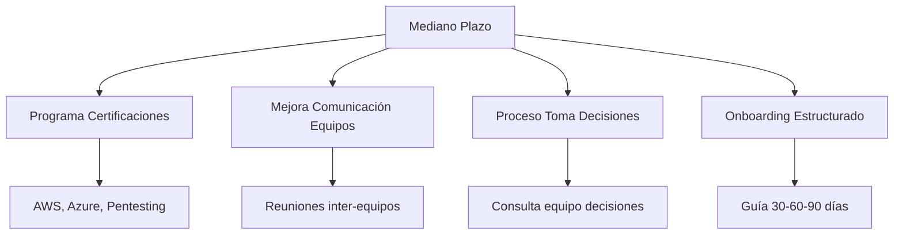

#### 1. Políticas de Recursos Humanos
- **Política de trabajo híbrido**: 1-2 días de home office por semana
- **Flexibilización del código de vestimenta**: Permitir vestimenta casual
- **Programa de reconocimiento**: Sistema formal de reconocimiento de logros
- **Revisión salarial**: Análisis de competitividad en el mercado

#### 2. Infraestructura y Herramientas
- **Mejora del espacio físico**: Mayor privacidad en puestos de trabajo
- **Herramientas de desarrollo**: Inversión en licencias y herramientas técnicas
- **Plataforma de aprendizaje**: Acceso a plataformas de capacitación online

#### 3. Estructura Organizacional
- **Definición de roles**: Clarificar responsabilidades y paths de carrera
- **Equipos especializados**: Sub-equipos por especialización técnica
- **Liderazgo técnico**: Identificar y desarrollar líderes internos###
 Acciones a Largo Plazo (6-12 meses)

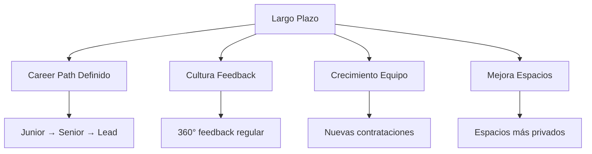

#### 1. Cultura Organizacional
- **Valores técnicos**: Principios de excelencia técnica
- **Innovación**: Espacios para experimentación y proyectos personales
- **Diversidad e inclusión**: Programas para fortalecer diversidad

#### 2. Crecimiento Profesional
- **Career paths definidos**: Rutas claras de crecimiento profesional
- **Programa de liderazgo**: Desarrollo de habilidades de liderazgo técnico
- **Conferencias y eventos**: Participación en eventos de la industria

#### 3. Retención y Atracción de Talento
- **Beneficios adicionales**: Ampliación del paquete de beneficios
- **Employer branding**: Posicionamiento como empleador atractivo
- **Metodología robusta**: Implementar metodologías de desarrollo avanzadas

---

## Análisis de Riesgos y Oportunidades

### Riesgos Identificados

#### Alto Riesgo:
1. **Rotación de talento**: Especialmente Flavio Sánchez (6-12 meses si no hay reconocimiento)
2. **Burnout**: Sobrecarga en algunos miembros clave como Gloriam Luna
3. **Conflictos interpersonales**: Tensiones que pueden escalar y afectar productividad

#### Riesgo Medio:
1. **Dependencia tecnológica**: Sobre-uso de IA limitando crecimiento técnico
2. **Falta de estándares**: Inconsistencia en calidad de código
3. **Comunicación**: Malentendidos entre equipos frontend-backend

#### Riesgo Bajo:
1. **Adaptación a nuevas tecnologías**: El equipo muestra flexibilidad
2. **Colaboración interna**: Base sólida de trabajo en equipo

### Oportunidades Identificadas

#### Oportunidades Inmediatas:
1. **Liderazgo interno**: Desarrollar líderes técnicos del equipo actual
2. **Especialización**: Crear centros de excelencia por área técnica
3. **Innovación**: Aprovechar interés en nuevas tecnologías

#### Oportunidades a Mediano Plazo:
1. **Expansión de servicios**: Capacidades para nuevos tipos de proyectos
2. **Mentoría externa**: Programa de intercambio con otras empresas
3. **Certificaciones grupales**: Programas de certificación masiva

---

## Métricas de Seguimiento y KPIs

### KPIs Propuestos:
1. **Satisfacción del empleado**: Encuestas trimestrales de clima laboral
2. **Retención de talento**: Tasa de rotación del equipo técnico
3. **Productividad**: Velocity de sprints y calidad de entregables
4. **Desarrollo profesional**: Número de certificaciones obtenidas por trimestre
5. **Colaboración**: Métricas de code review y pair programming

### Frecuencia de Evaluación:
- **Reuniones 1a1**: Mensual con cada miembro del equipo
- **Revisión de progreso**: Trimestral del plan de acción
- **Evaluación integral**: Semestral del programa completo

### Recursos Necesarios:
- **Presupuesto para certificaciones**: $5,000-10,000 anuales
- **Herramientas de desarrollo**: $2,000-3,000 anuales
- **Tiempo de management**: 20% adicional para seguimiento
- **Espacio físico**: Mejoras en privacidad de puestos---

## Casos Específicos de Atención Individual

### Perfiles Destacados:

#### **Anel Martez (Backend Jr)**
- **Fortalezas**: Primer trabajo como programador, alta motivación por aprender
- **Desafíos**: Dependencia excesiva de IA, necesita mentoría estructurada
- **Recomendación**: Asignar mentor senior, plan de desarrollo técnico específico

#### **Eva Gutierrez (Backend Jr)**
- **Fortalezas**: Proactiva, busca responsabilidades adicionales
- **Oportunidades**: Potencial para crecimiento rápido, habilidades multidisciplinarias
- **Recomendación**: Fast-track para proyectos de mayor complejidad

#### **Flavio Sánchez (Backend)**
- **Fortalezas**: Conocimiento técnico sólido, interés en DevOps y ML
- **Expectativas**: Busca reconocimiento y crecimiento profesional
- **Recomendación**: Considerar para roles de liderazgo técnico

#### **Gloriam Luna (Frontend)**
- **Fortalezas**: Experiencia sólida, aspira a backend
- **Desafíos**: Necesita mayor definición en procesos
- **Recomendación**: Plan de transición a full-stack developer

#### **Gustavo Jordan (Designer/Multi-role)**
- **Fortalezas**: Visión integral de UX/UI, habilidades de liderazgo
- **Desafíos**: Conflictos con procesos de accesibilidad
- **Recomendación**: Liderar iniciativas de estándares de diseño

---

## Conclusiones Estratégicas

### Fortalezas del Equipo
- **Alta colaboración**: El equipo muestra disposición para ayudarse mutuamente
- **Ambiente positivo**: Valoración del ambiente tranquilo y flexible
- **Diversidad técnica**: Amplio rango de habilidades técnicas complementarias
- **Motivación por aprender**: Interés genuino en certificaciones y nuevas tecnologías
- **Cultura colaborativa establecida**: 100% valora el ambiente de trabajo actual
- **Alineación en comunicación**: Preferencias consistentes facilitan liderazgo efectivo

### Desafíos Críticos a Abordar
1. **Brecha en procesos técnicos**: Falta de metodología estructurada afecta productividad
2. **Expectativas vs. realidad organizacional**: Desconexión entre solicitudes del equipo y políticas actuales
3. **Gestión de conflictos interpersonales**: Tensiones que requieren intervención directa
4. **Comunicación inter-equipos**: Necesidad urgente de mejorar coordinación Frontend-Backend
5. **Procesos documentados**: Falta de metodologías claras y documentación estructurada

### Oportunidades de Crecimiento
1. **Desarrollo de liderazgo técnico**: Varios miembros muestran potencial de liderazgo
2. **Especialización y certificaciones**: Interés generalizado representa oportunidad estructurada
3. **Mejora de procesos como ventaja competitiva**: Implementación de metodologías robustas
4. **Flexibilidad laboral**: Demanda alta por opciones de trabajo remoto
5. **Desarrollo profesional**: Necesidad de paths de carrera más claros y estructurados

### Riesgos Identificadost
- **Rotación potencial**: Algunos miembros evalúan opciones externas
- **Burnout**: Menciones de estrés y sobrecarga en casos específicos
- **Comunicación**: Conflictos interpersonales que requieren atención inmediata---

# Próximos Pasos Inmediatos

### Semana 1-2:
1. Presentar reporte a gerencia y obtener aprobación para implementación
2. Comunicar hallazgos principales al equipo de manera transparente
3. Priorizar acciones según recursos disponibles y urgencia

### Mes 1:
1. **Implementar reuniones 1a1 mensuales** con cada miembro del equipo
2. **Crear templates de Jira mejorados** con criterios de aceptación claros
3. **Establecer proceso de code review** estándar y obligatorio
4. **Iniciar sesiones de mentoría técnica** entre seniors y juniors

### Mes 2-3:
1. **Desarrollar plan de home office piloto** (2 días por semana)
2. **Lanzar programa piloto de mentoría** estructurada
3. **Workshops de comunicación interdepartamental** para resolver conflictos
4. **Evaluación de herramientas y licencias** necesarias para el equipo

### Indicadores de Éxito a 6 meses:
- Reducción del 50% en conflictos reportados entre equipos
- Aumento del 30% en satisfacción laboral medida por encuestas
- 100% del equipo con al menos una certificación en progreso
- Implementación completa de procesos de code review
- Política de trabajo híbrido funcionando efectivamente
- Reducción significativa en dependencia de herramientas de IA

---

## Reflexión Final

### Panorama General del Equipo

El equipo de tecnología de CalTeks presenta un perfil excepcional con gran potencial de crecimiento. Se trata de un grupo diverso de 12 profesionales que abarca todas las áreas técnicas necesarias: desarrollo frontend, backend, QA, diseño, ciberseguridad y soporte técnico. La mayoría son profesionales junior con alta motivación por aprender y crecer, lo que representa una excelente oportunidad para moldear una cultura técnica sólida y sostenible.

### Factores Críticos de Éxito

Este equipo tiene todos los ingredientes para ser excepcional: talento técnico diverso, actitud colaborativa genuina, ambición profesional clara y valoración del ambiente laboral actual. Los desafíos identificados son completamente solucionables y las oportunidades son significativas y alcanzables.

El éxito futuro dependerá de la capacidad de liderazgo para:
- **Mantener y potenciar la cultura colaborativa existente** como activo fundamental
- **Implementar estructura sin perder la flexibilidad valorada** por el equipo
- **Alinear las expectativas individuales con los objetivos organizacionales** de manera win-win
- **Convertir la ambición individual en crecimiento colectivo** sostenible

### Recomendaciones Estratégicas Finales

1. **Priorizar la retención del talento**: Con un equipo tan colaborativo y ambicioso, la retención debe ser prioridad absoluta. Las políticas de trabajo remoto y desarrollo profesional son inversiones estratégicas, no gastos.

2. **Invertir en estructura antes que en crecimiento**: Antes de expandir el equipo, es crucial establecer procesos sólidos, documentación clara y metodologías de trabajo robustas. Un equipo de 12 bien estructurado es más valioso que uno de 20 desorganizado.

3. **Crear rutas de carrera claras**: La ambición del equipo debe canalizarse con planes de carrera específicos, mentorías estructuradas y oportunidades de crecimiento interno. Esto convertirá la ambición individual en crecimiento organizacional.

**La inversión en este equipo, tanto en procesos como en desarrollo profesional, tiene el potencial de generar retornos exponenciales en productividad, calidad, innovación y capacidad competitiva organizacional.**

---

**Fecha del Reporte**: 15 de septiembre de 2025  
**Preparado por**: Líder de Equipo Tecnológico CalTeks  
**Próxima Revisión**: Diciembre 2025  
**Versión**: Final Consolidada 1.0  
**Total de reuniones**: 12  
**Participación**: 100% del equipo de tecnología

---

*Este reporte es confidencial y está destinado únicamente para uso interno de CalTeks. La información contenida refleja las opiniones y expectativas expresadas por los miembros del equipo durante las reuniones 1a1 iniciales y debe ser tratada con la debida confidencialidad y respeto hacia los participantes.*