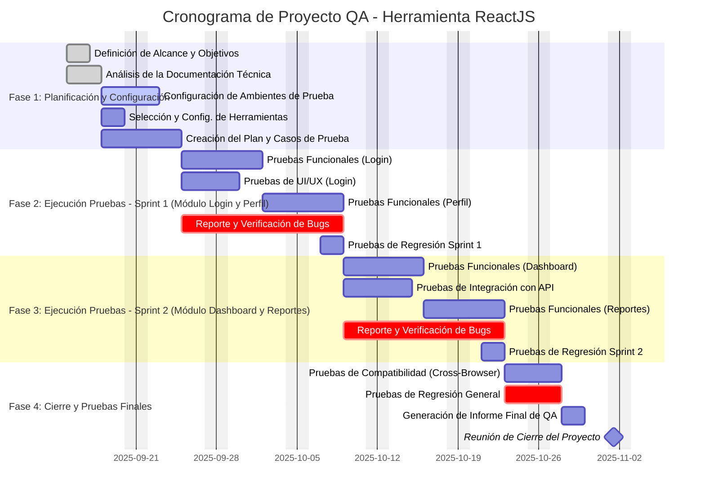

### 1. Definición y Alcance del Proyecto

Es el punto de partida para entender la magnitud del trabajo.

- **Objetivos Claros del Proyecto:** 
	- ¿Qué se busca lograr con las pruebas? _(Ej: Garantizar el funcionamiento sin errores de las funcionalidades críticas, validar la compatibilidad con navegadores específicos, asegurar una experiencia de usuario fluida, etc.)._
		- 
- **Alcance Detallado:**
    - **Funcionalidades a Probar:** 
	    - Un listado exhaustivo de todas las _vistas_, _componentes_, _flujos de usuario_ y _funcionalidades_ de la aplicación ReactJS que serán sometidas a pruebas.
		    - 
    - **Funcionalidades Fuera del Alcance:** Definir explícitamente qué _partes de la aplicación_ no se probarán para evitar malentendidos.
	    - 
- **Criterios de Aceptación:** 
	- ¿Bajo qué condiciones se considerará que una funcionalidad ha pasado las pruebas? ¿Cuáles son los estándares de calidad que debe cumplir la aplicación?
		- 
- **Entregables del Proyecto:** 
	- ¿Qué documentos o artefactos se espera que genere el equipo de QA? _(Ej: Plan de pruebas, casos de prueba, reportes de bugs, informe de resultados final)._
		- Plan de pruebas
		- Reporte de bugs
		- Informe de resultados final

### 2. Información Técnica de la Aplicación

Comprender la arquitectura y el estado actual de la herramienta es crucial.

- **Acceso a la Aplicación:** _URLs y credenciales para los diferentes ambientes de prueba (desarrollo, staging/QA)._
	- 
- **Documentación Técnica y Funcional:** _Manuales de usuario, especificaciones de requerimientos, historias de usuario, o cualquier documento que describa cómo debe funcionar la aplicación._
	- 
- **Arquitectura de la Aplicación:** _Entender si es una Single Page Application (SPA), si utiliza librerías de manejo de estado como Redux o MobX, y cómo se comunica con las APIs de backend._
	- 
- **Integraciones con Terceros:**  _Un listado de las APIs, servicios externos o componentes de terceros con los que interactúa la herramienta, ya que estos también pueden requerir pruebas de integración._
	- 
- **Repositorio de Código (Opcional pero Recomendado):** _El acceso al código fuente puede ayudar a los ingenieros de QA a entender mejor la implementación y a realizar pruebas más técnicas (como pruebas de componentes con herramientas como Storybook)._
	- 

### 3. Recursos y Equipo

Conocer los recursos humanos y materiales disponibles es fundamental para una planificación realista.

- **Equipo de QA Asignado:**
    - **Roles y Responsabilidades:** 
	    - [[Ronoaldo Lasso]] y [[Ricardo Cuan]] Gestores del proyecto
	    - [[Didiel Saenz]] Experto en QA. 
	    - [[Jairo Cespedes]] QA jr.
	    - [[Miguel Lombardi]] QA jr.
    - **Nivel de Experiencia:** 
	    - Didiel tiene alta experiencia en QA
	    - Jairo no tiene experiencia en QA, por lo que Didiel tiene que enseñarle los procesos a realizar a Jairo.
    - **Disponibilidad:** 
	    - Es una dedicación de 8 días a la semana de lunes a viernes.
- **Equipo de Desarrollo:** 
	- Líder técnico: Ricardo
	- Desarrolladbores: Didiel, Jairo
- **Herramientas Disponibles:**
    - **Gestión de Proyectos y Casos de Prueba:**
	    - Uso de Jira para seguimiento
	    - Uso de herramientas dadas por el cliente
    - **Herramientas de Automatización (si aplica):** _Si se planea automatizar, ¿qué herramientas se utilizarán? (Ej: Cypress, Playwright, Jest, React Testing Library)._
	    - No se planea automatizar
    - **Navegadores y Dispositivos:** Lista de navegadores (Chrome, Firefox, Safari, Edge) y dispositivos (móviles, tabletas, resoluciones de pantalla) en los que se debe garantizar el correcto funcionamiento.
		- Chrome
		- Firefox
		- Safari

### 4. Estrategia y Procesos de QA

La metodología de trabajo definirá la estructura del cronograma.

- **Tipos de Pruebas a Realizar:** _Definir qué pruebas se ejecutarán:_
    - **Pruebas Funcionales:** _Validar que cada funcionalidad cumpla con los requerimientos._
	    - 
    - **Pruebas de Regresión:** _Asegurar que los nuevos cambios no hayan afectado funcionalidades existentes._
	    - 
    - **Pruebas de UI/UX:** _Verificar que la interfaz sea intuitiva y cumpla con el diseño establecido._
	    - 
    - **Pruebas de Compatibilidad:** _Probar en los diferentes navegadores y dispositivos definidos._oooo
	    - 
    - **Pruebas de Rendimiento (si aplica):** _Medir los tiempos de carga de la aplicación y la respuesta a la interacción del usuario._
	    - 
    - **Pruebas de API (si aplica):** _Validar la comunicación entre el frontend (ReactJS) y el backend._
	    - 

- **Metodología de Trabajo:** 
	- El proyecto se gestionará bajo la metodología Cascada con componentes ágil como el uso de tareas en un kanban (jira) y la separación del proyecto en "hitos".
    
- **Proceso de Gestión de Defectos:** 
	- ¿Cuál será el ciclo de vida de un bug? (Ej: Reportado -> En revisión -> Asignado -> Solucionado -> Verificado -> Cerrado).                                 

---

