# PRESENTACIÓN: RESULTADOS REUNIONES 1A1 INICIALES
## CalTeks - Departamento de Tecnología

---

## Diapositiva 1: Portada
**TÍTULO:** Resultados Reuniones 1a1 Iniciales - Equipo de Tecnología CalTeks

**TEXTO A VISUALIZAR:**
# Reuniones 1a1 Iniciales
## Equipo de Tecnología CalTeks
### Septiembre 2025

**13 reuniones realizadas**  
**100% cobertura del equipo**  
**Línea base establecida**

**GRÁFICA:**
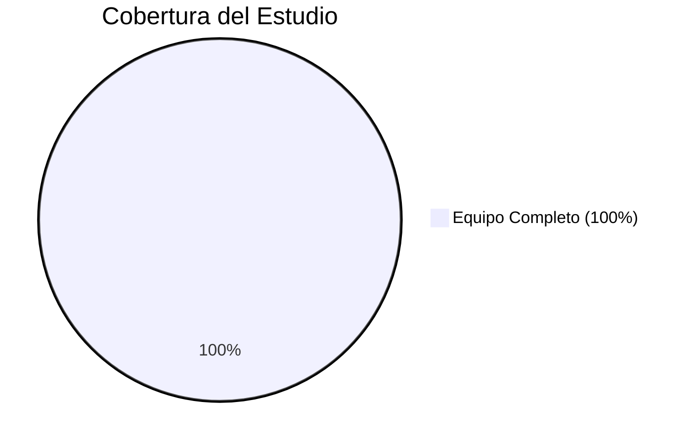

**TEXTO DEL LOCUTOR:**
"Buenos días. Hoy presentamos los resultados de las 13 reuniones 1a1 iniciales realizadas con todo el equipo de tecnología de CalTeks durante septiembre. Este proceso nos ha permitido establecer una línea base completa sobre el estado del equipo, sus expectativas y oportunidades de mejora."

---

## Diapositiva 2: Composición del Equipo
**TÍTULO:** Perfil del Equipo - Diversidad Técnica Completa

**TEXTO A VISUALIZAR:**
## Composición por Roles
- **Backend:** 4 personas (31%)
- **Frontend:** 4 personas (31%) 
- **Soporte Técnico:** 2 personas (15%)
- **QA:** 1 persona (8%)
- **Ciberseguridad:** 1 persona (8%)
- **Diseño/Fullstack:** 1 persona (8%)

**GRÁFICA:**
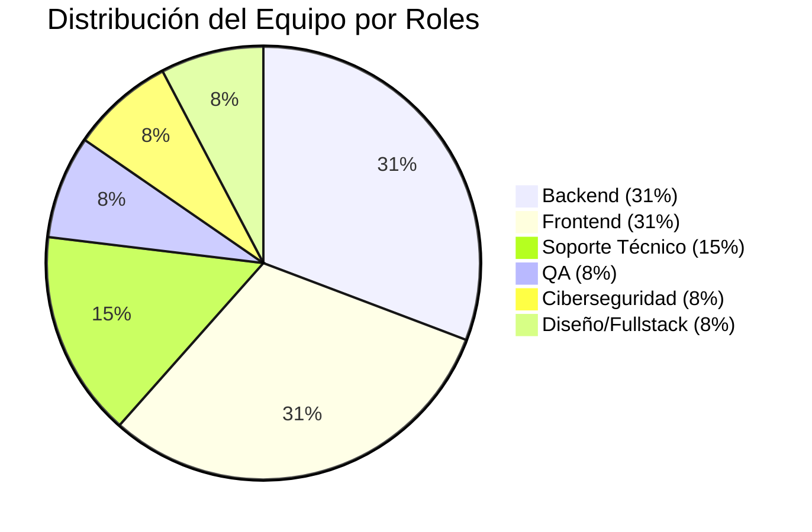

**TEXTO DEL LOCUTOR:**
"Nuestro equipo presenta una distribución equilibrada con cobertura completa del stack tecnológico. Tenemos igual representación en frontend y backend, con especialistas en áreas críticas como QA, ciberseguridad y soporte técnico. Esta diversidad nos posiciona bien para proyectos complejos."

---

## Diapositiva 3: Nivel de Experiencia
**TÍTULO:** Perfil de Experiencia - Oportunidad de Mentoría

**TEXTO A VISUALIZAR:**
## Distribución por Experiencia
- **Junior:** 6 personas (46%)
- **Experiencia Media:** 4 personas (31%)
- **Senior/Especializado:** 3 personas (23%)

### Potencial de Mentoría
**Mentores identificados:** Flavio, Gustavo, Didiel  
**Mentees potenciales:** 6 desarrolladores junior

**GRÁFICA:**
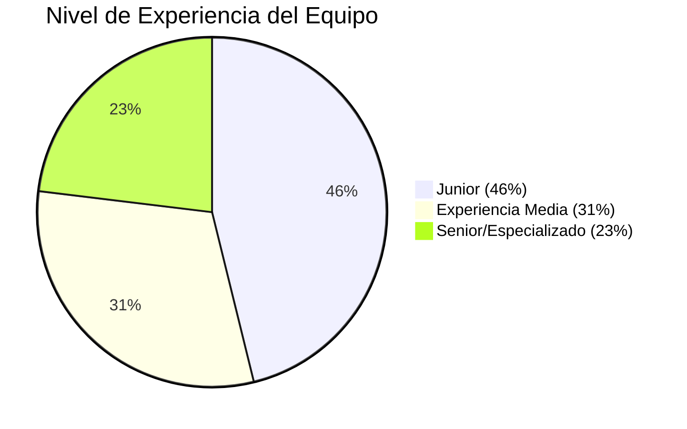

**TEXTO DEL LOCUTOR:**
"El 46% del equipo está en nivel junior, lo que representa una gran oportunidad. Tenemos 3 personas con experiencia senior que pueden actuar como mentores, creando un programa estructurado de desarrollo interno que acelere el crecimiento de todo el equipo."

---

## Diapositiva 4: Fortaleza Cultural
**TÍTULO:** Cultura Colaborativa Excepcional

**TEXTO A VISUALIZAR:**
## Principales Fortalezas Identificadas

### ✅ Cultura Colaborativa Sólida
- **100%** valora el ambiente de trabajo positivo
- Disposición natural de ayuda entre compañeros
- Comunicación abierta y respeto mutuo

### ✅ Alineación en Comunicación
- **92%** prefiere feedback en persona
- **69%** prefiere feedback inmediato
- **77%** prefiere reconocimiento privado

**GRÁFICA:**
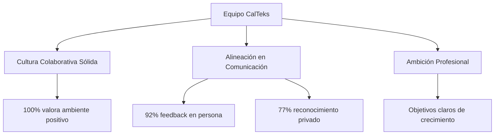

**TEXTO DEL LOCUTOR:**
"Tenemos una base cultural excepcional. El 100% del equipo valora positivamente nuestro ambiente laboral, y hay una alineación notable en las preferencias de comunicación. Esto es nuestro activo más valioso y la base para cualquier crecimiento futuro."

---

## Diapositiva 5: Objetivos Profesionales
**TÍTULO:** Ambición Profesional Clara - Oportunidades de Desarrollo

**TEXTO A VISUALIZAR:**
## Objetivos a 12 Meses por Categoría

- **Crecimiento Técnico:** 8 personas
- **Expansión Fullstack:** 4 personas  
- **Especialización Avanzada:** 3 personas
- **Desarrollo de Liderazgo:** 2 personas

### Áreas de Interés Principales
- Certificaciones AWS/Azure
- DevOps y CI/CD
- Machine Learning
- Ciberseguridad (Pentesting)

**GRÁFICA:**
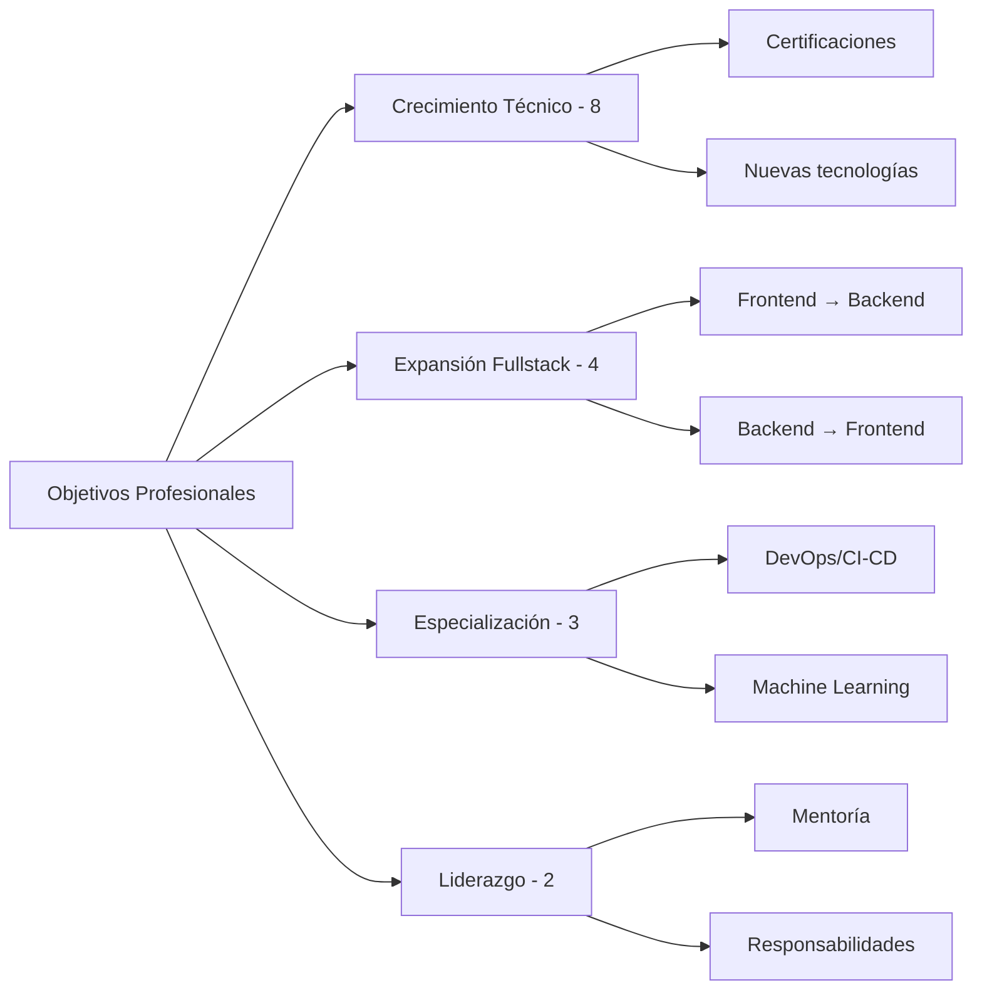

**TEXTO DEL LOCUTOR:**
"La ambición profesional del equipo es impresionante. Todos tienen objetivos claros de crecimiento, desde mejoras técnicas hasta aspiraciones de liderazgo. Esto representa una oportunidad única para crear programas de desarrollo que retengan talento y eleven nuestras capacidades."

---

## Diapositiva 6: Principal Desafío
**TÍTULO:** Expectativa vs. Realidad - Trabajo Remoto

**TEXTO A VISUALIZAR:**
## Principal Cambio Solicitado

### 🏠 Trabajo Remoto/Home Office
**69% del equipo** lo solicita como principal cambio

### Otros Cambios Deseados
- Código de vestimenta flexible (15%)
- Aumentos salariales (15%)
- Mejores espacios de trabajo (8%)

**GRÁFICA:**
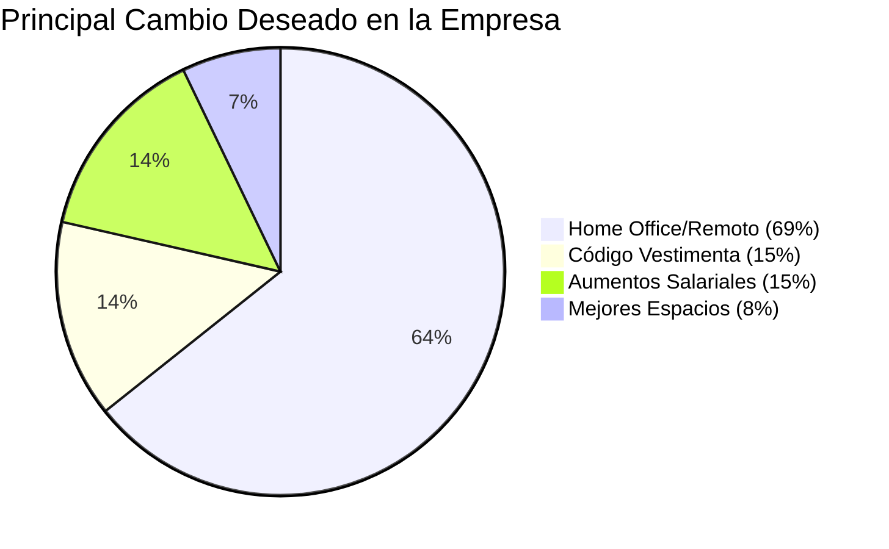

**TEXTO DEL LOCUTOR:**
"El hallazgo más significativo es que 9 de 13 personas solicitan trabajo remoto como su principal cambio deseado. Esta es una expectativa clara que debemos abordar estratégicamente, ya que impacta directamente la retención y satisfacción del equipo."

---

## Diapositiva 7: Problemas Críticos
**TÍTULO:** Brechas Identificadas - Oportunidades de Mejora

**TEXTO A VISUALIZAR:**
## Problemas Recurrentes Identificados

### 🔧 Procesos Técnicos
- Falta metodología de desarrollo estructurada
- Documentación técnica insuficiente
- Procesos de code review informales
- Descoordinación frontend-backend

### 📋 Gestión de Proyectos
- Tareas de Jira mal definidas
- Falta de historias de usuario detalladas
- Criterios de aceptación poco claros

**GRÁFICA:**
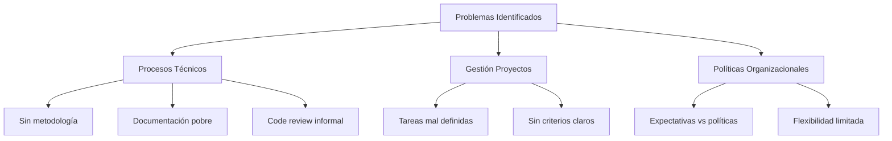

**TEXTO DEL LOCUTOR:**
"Hemos identificado tres áreas críticas de mejora. Los procesos técnicos necesitan estructura, la gestión de proyectos requiere claridad, y existe una desconexión entre las expectativas del equipo y nuestras políticas actuales. Estos son problemas solucionables con las acciones correctas."

---

## Diapositiva 8: Plan de Acción Inmediato
**TÍTULO:** Acciones Inmediatas - Primeros 30 Días

**TEXTO A VISUALIZAR:**
## Implementación Inmediata (30 días)

### 1️⃣ Reuniones 1a1 Regulares
- **Frecuencia:** Mensual (preferencia del 100%)
- **Formato:** En persona, 45-60 minutos
- **Objetivo:** Seguimiento personalizado

### 2️⃣ Daily Standups
- **Duración:** 15 minutos diarios
- **Formato:** Asíncrono, para no impedir las labores diarias 
- **Objetivo:** Mejorar coordinación equipos

### 3️⃣ Templates Mejorados Jira
- **Incluir:** Criterios de aceptación claros
- **Formato:** Historias de usuario estructuradas

**GRÁFICA:**
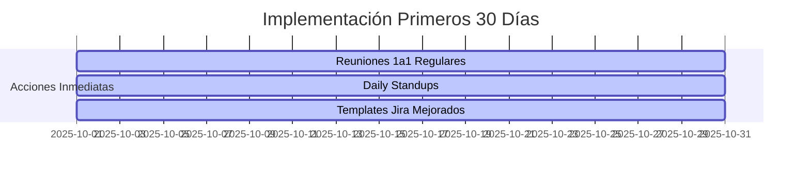

**TEXTO DEL LOCUTOR:**
"Comenzamos con tres acciones inmediatas que abordan los problemas más urgentes. Las reuniones 1a1 mensuales responden a la preferencia del equipo, los daily standups mejorarán la coordinación, y los templates de Jira resolverán la confusión en las tareas."

---

## Diapositiva 9: Estrategia Mediano Plazo
**TÍTULO:** Iniciativas Estratégicas - 3 Meses

**TEXTO A VISUALIZAR:**
## Mediano Plazo (3 meses)

### 🎯 Programa de Mentoría Técnica
- **Mentores:** Flavio, Gustavo, Didiel
- **Mentees:** 6 desarrolladores junior
- **Actividades:** Code review, pair programming

### 🔍 Code Review Estructurado
- **Proceso:** Git-based, obligatorio
- **Objetivo:** Calidad + conocimiento compartido

**GRÁFICA:**
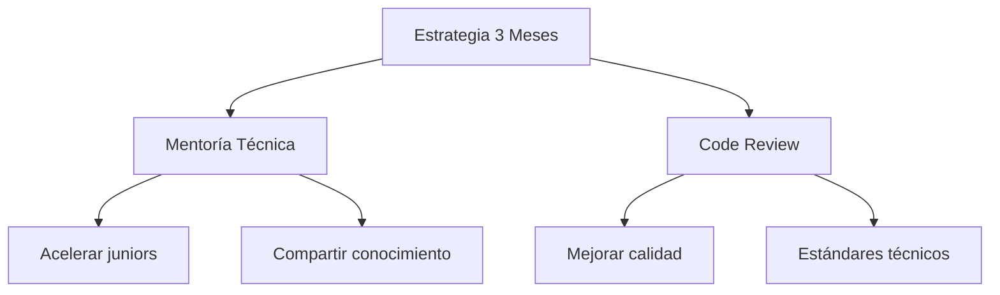

**TEXTO DEL LOCUTOR:**
"En el mediano plazo, implementamos tres iniciativas estratégicas. El programa de mentoría aprovecha nuestro talento senior, el code review eleva la calidad técnica, y el piloto de trabajo híbrido aborda la principal solicitud del equipo de manera controlada."

---

## Diapositiva 10: Visión a Largo Plazo
**TÍTULO:** Transformación Organizacional - 6-12 Meses

**TEXTO A VISUALIZAR:**
## Largo Plazo (6-12 meses)

### 🎓 Programa de Certificaciones
- **Rutas de aprendizajesr.** Definición de estrategias de crecimiento
- **ROI:** Capacidades técnicas elevadas. Soluciones más rápidas, más complejas y mejor estructuradas.

### 👥 Liderazgo Técnico Interno
- **Tech Leads:** Por proyecto (Frontend, Backend, QA)
- **Candidatos:** Flavio, Gloriam identificados
- **Beneficio:** Escalabilidad organizacional, mayor organización.

### ⚡ Metodología Ágil Completa
- **Framework:** Scrum adaptado
- **Objetivo:** Resolver problemas de proceso integralmente

**GRÁFICA:**
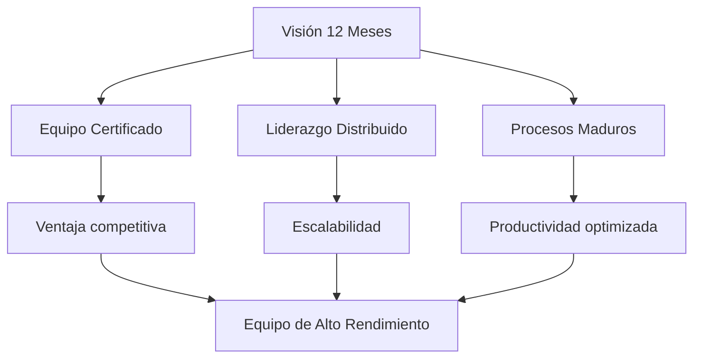

**TEXTO DEL LOCUTOR:**
"Nuestra visión a 12 meses es transformar este equipo en una organización de alto rendimiento. Con certificaciones técnicas, liderazgo interno distribuido y procesos maduros, tendremos la base para escalar significativamente nuestras capacidades."

---

## Diapositiva 12: Indicadores de Seguimiento
**TÍTULO:** Métricas de Éxito - Cómo Mediremos el Progreso

**TEXTO A VISUALIZAR:**
## KPIs Definidos

### 😊 Satisfacción del Equipo
- **Retención:** Meta 95%+ (actualmente alto)
- **Satisfacción 1a1s:** Escala 1-10, meta 8+
- **Engagement:** 80%+ participación en iniciativas

### 🚀 Productividad Técnica
- **Tiempo entrega:** -20% con mejores procesos
- **Calidad código:** -30% bugs con code review
- **Coordinación:** -40% bloqueos con daily standups

### 📚 Desarrollo Profesional
- **Certificaciones:** 2-3 por persona/año
- **Promociones internas:** 2-3 tech leads en 12 meses

**GRÁFICA:**
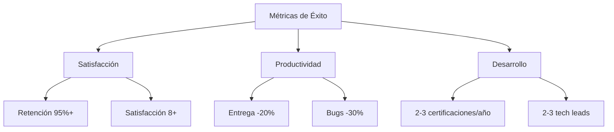

**TEXTO DEL LOCUTOR:**
"Establecemos métricas claras en tres dimensiones: satisfacción del equipo, productividad técnica y desarrollo profesional. Estas métricas nos permitirán ajustar nuestro enfoque y demostrar el valor de las inversiones realizadas."

---

## Diapositiva 13: Próximos Pasos
**TÍTULO:** Plan de Implementación - Siguientes 30 Días

**TEXTO A VISUALIZAR:**
## Acciones Inmediatas - Octubre 2025

### ✅ Semana 1-2
- Establecer calendario 1a1s mensuales
- Implementar daily standups
- Crear templates Jira mejorados

### ✅ Semana 3-4
- Iniciar programa mentoría (identificar pairs)
- Definir proceso code review
- Evaluar herramientas trabajo híbrido

### 📋 Responsables
- **Senior:** Seguimiento 1a1s y coordinación
- **Mentor:** Mentoría y estándares técnicos
- **RRHH:** Evaluación políticas flexibilidad

**GRÁFICA:**
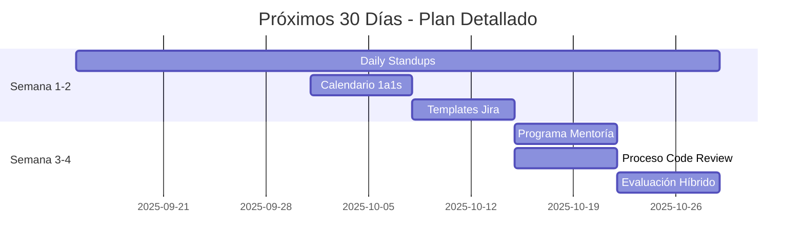

**TEXTO DEL LOCUTOR:**
"Tenemos un plan claro para los próximos 30 días. Las primeras dos semanas nos enfocaremos en establecer las bases: 1a1s, standups y mejores templates. Las siguientes dos semanas iniciaremos los programas más complejos de mentoría y code review."

---

## Diapositiva 14: Conclusiones
**TÍTULO:** Reflexión Final - El Potencial de Nuestro Equipo

**TEXTO A VISUALIZAR:**
## Conclusiones Clave

### 🌟 Tenemos Todos los Ingredientes para el Éxito
- ✅ Talento técnico diverso y competente
- ✅ Cultura colaborativa establecida  
- ✅ Ambición profesional clara
- ✅ Alineación en comunicación

### 🎯 Factores Críticos de Éxito
1. **Preservar cultura** mientras implementamos estructura
2. **Alinear expectativas** individuales con objetivos organizacionales  
3. **Invertir en el equipo** como ventaja competitiva

### 🚀 Oportunidad Estratégica
**La inversión en este equipo tiene potencial de retornos exponenciales**

**GRÁFICA:**
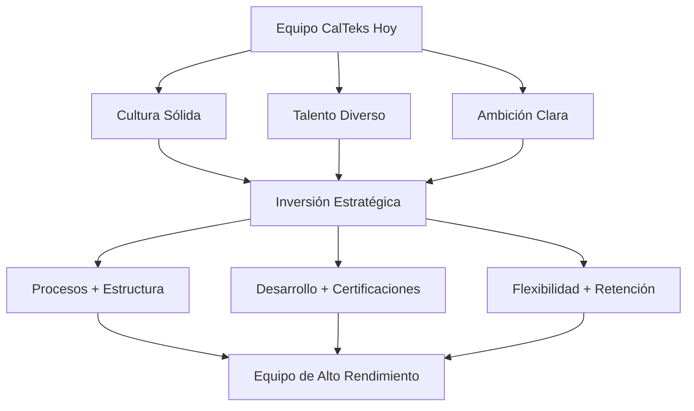

**TEXTO DEL LOCUTOR:**
"En conclusión, tenemos un equipo excepcional con todos los ingredientes para el éxito. La cultura colaborativa, el talento diverso y la ambición clara son activos únicos. Con la inversión estratégica correcta en procesos, desarrollo y flexibilidad, podemos transformar este equipo en una ventaja competitiva significativa para CalTeks."

---

## Diapositiva 15: Preguntas y Discusión
**TÍTULO:** Sesión de Preguntas

**TEXTO A VISUALIZAR:**
# ¿Preguntas?

## Temas para Discusión
- Priorización de iniciativas
- Presupuesto y recursos
- Timeline de implementación
- Políticas organizacionales
- Métricas y seguimiento

### Contacto
**Ricardo Cuan**  
Senior Software Engineer  
Líder del Proceso 1a1

**GRÁFICA:**
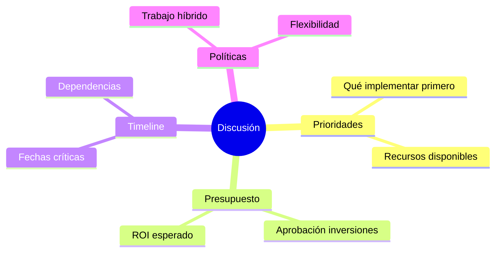

**TEXTO DEL LOCUTOR:**
"Ahora abrimos el espacio para preguntas y discusión. Estoy disponible para profundizar en cualquier aspecto del análisis, desde la priorización de iniciativas hasta los detalles de implementación. El éxito de este plan depende de nuestro compromiso colectivo y la alineación en las decisiones estratégicas."